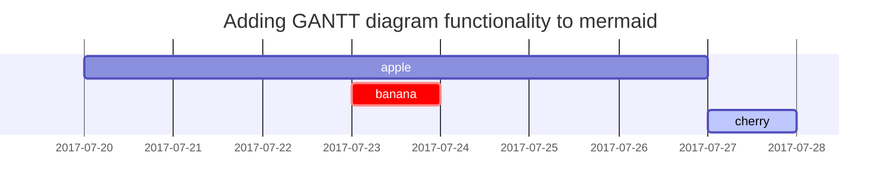

# Design & Typography Guidelines

This document outlines the styling and formatting conventions for creating content, based on the Chirpy theme's typography examples.

## Text Elements

### Headings

The theme supports standard Markdown headings, which can be styled with special classes.

```markdown
# H1 — heading
{: .mt-4 .mb-0 }

## H2 — heading
{: data-toc-skip='' .mt-4 .mb-0 }

### H3 — heading
{: data-toc-skip='' .mt-4 .mb-0 }

#### H4 — heading
{: data-toc-skip='' .mt-4 }
```

### Paragraphs

Standard paragraph text is used for long-form content.

### Lists

Several list types are available:

**Ordered List:**
1.  Firstly
2.  Secondly
3.  Thirdly

**Unordered List:**
*   Chapter
    *   Section
        *   Paragraph

**ToDo List:**
- [ ] Job
  - [x] Step 1
  - [ ] Step 2
  - [ ] Step 3

**Description List:**
```markdown
Sun
: the star around which the earth orbits

Moon
: the natural satellite of the earth, visible by reflected light from the sun
```

### Block Quote

> This line shows the _block quote_.

### Links

Standard markdown links are supported: `<http://127.0.0.1:4000>`

### Footnotes

Footnotes can be created using `[^name]` and defined later in the document.

**Example:**
```markdown
Click the hook will locate the footnote[^footnote].

[^footnote]: The footnote source
```

## Code and Technical Text

### Inline Code

Use backticks for `inline code`.

### Filepath

Use the `filepath` class to style filepaths.

**Example:**
```markdown
Here is the `/path/to/the/file.extend`{: .filepath}.
```
**Renders as:**
Here is the `/path/to/the/file.extend`{: .filepath}.

### Code Blocks

Code blocks can be created with triple backticks. You can specify a language for syntax highlighting and an optional filename.

**Specific Language:**
```bash
if [ $? -ne 0 ]; then
  echo "The command was not successful.";
  #do the needful / exit
fi;
```

**Specific Filename:**
```sass
// _sass/jekyll-theme-chirpy.scss
@import
  "colors/light-typography",
  "colors/dark-typography";
```
{: file='_sass/jekyll-theme-chirpy.scss'}

## Special Formatting

### Prompts

The theme provides special blockquote-style prompts to highlight information.

**Tip:**
> An example showing the `tip` type prompt.
{: .prompt-tip }
```markdown
> An example showing the `tip` type prompt.
{: .prompt-tip }
```

**Info:**
> An example showing the `info` type prompt.
{: .prompt-info }
```markdown
> An example showing the `info` type prompt.
{: .prompt-info }
```

**Warning:**
> An example showing the `warning` type prompt.
{: .prompt-warning }
```markdown
> An example showing the `warning` type prompt.
{: .prompt-warning }
```

**Danger:**
> An example showing the `danger` type prompt.
{: .prompt-danger }
```markdown
> An example showing the `danger` type prompt.
{: .prompt-danger }
```

### Tables

Standard Markdown tables with alignment are supported.

| Company                      | Contact          | Country |
| :--------------------------- | :--------------- | ------: |
| Alfreds Futterkiste          | Maria Anders     | Germany |
| Island Trading               | Helen Bennett    |      UK |
| Magazzini Alimentari Riuniti | Giovanni Rovelli |   Italy |

## Rich Content

### Mathematics (MathJax)

To enable MathJax on a page, add `math: true` to the frontmatter.

**Block-level equation:**
```latex
$$
\sum_{n=1}^\infty 1/n^2 = \frac{\pi^2}{6}
$$
```

**Inline equation:**
When $a \ne 0$, there are two solutions.

### Diagrams (Mermaid)

To enable Mermaid on a page, add `mermaid: true` to the frontmatter.



### Images

Images can be styled with various classes for alignment, size, and appearance.

**Default (Center aligned):**
```markdown
{: width="972" height="589" }
_Full screen width and center alignment_
```

**Float to left/right:**
```markdown
{: .w-50 .left }
{: .w-50 .right }
```

**Dark/Light Mode Toggling & Shadow:**
```markdown
{: .light .w-75 .shadow .rounded-10 }
{: .dark .w-75 .shadow .rounded-10 }
```

### Video (YouTube)

Embed a YouTube video using the include helper.

```liquid

```
Replace `VIDEO_ID` with the actual ID from the YouTube URL.
